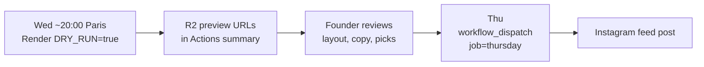

# Thursday Lens — Editorial Spec

Locked Aug 2026. Decisions: [DECISIONS.md](DECISIONS.md). Calendar context: [CONTEXT.md](CONTEXT.md).

## Cycle

8-week repeating sequence:

```
Week:  1         2       3         4       5        6         7        8
Slot:  dance     area    dance     stats   area     dance     area     stats
→ repeat
```

Cycle position determines slot **type**. The selector picks the best **variant** inside that type based on live data.

## Event window

- **Thu–Sun only** (Europe/Paris), not full ISO week.
- Fetch from Thursday 00:00 through Sunday 23:59 of the relevant week.
- On Wed preview: upcoming Thu–Sun. On Thu publish: current Thu–Sun.
- **Exclude** event IDs featured in this week's Tuesday carousel.
- **Exclude** cancelled events (`activeEventsOnly()`).

## Editorial model (Aug 2026)

Two distinct carousel promises — do not mix their rules:

| Slot | Scope | Styles on cards | Cover example |
|------|--------|-----------------|---------------|
| **Dance spotlight** | **Global** — all regions in Thu–Sun pool | **Pure only** — single dance tag matching featured style | *"3 soirées bachata ce week-end"* |
| **Autres danses** | Global | Rare styles (zouk, tango, WCS, semba); focused picks | *"Et si tu sortais des sentiers battus ?"* |
| **Region spotlight** (`area-focus`) | **One area** — BAB, Landes, Béarn, or Euskadi | **All styles** — mixed SBK parties OK | *"Où danser au Pays Basque ce week-end ?"* + *"8 soirées · Salsa · Bachata · …"* |

Dance posts answer *"I want bachata this weekend (anywhere)."*  
Region posts answer *"What's on near me (any style)?"*

## Scarcity

- Show **3 event cards** on dance/area posts (not 4 like Tuesday).
- Closing slide: "+X autres sur l'app" where X = total matching events minus 3.
- No address, ticket links, or full descriptions on slides.

## Areas (not cities)

| Slug | Display name | Example cities |
|------|--------------|----------------|
| `bab` | BAB | Bayonne, Anglet, Biarritz |
| `landes` | Landes | Dax, Mont-de-Marsan, Saint-Paul-lès-Dax |
| `bearn` | Béarn | Pau, Tarbes, Lourdes |
| `euskadi` | Euskadi | Donostia, Hondarribia, Irun |

City → area mapping lives in `src/config/areas.ts`.

**Naming:** "Béarn" is acceptable in social copy (Tarbes is Bigorre but brevity wins). Use **Euskadi**, not generic "Spain". Cross-border copy may use *"l'autre côté de la frontière"*.

## Dance spotlight

**Global scope.** Picks from the full Thu–Sun pool (all mapped areas + unmapped cities). Never filter by region.

### Core dances

`salsa`, `bachata`, `kizomba`

```
score(dance) = pureEventCount(dance) × freshnessFactor(dance)
```

- **Pure only:** event must have exactly one dance tag, matching the featured dance
- Minimum: **3 pure events** to publish (`THURSDAY_EVENT_COUNT`)
- Fallback order: try next core dance by score → **autres danses** → skip
- Headline count = **pure pool size** (not tagged/mixed pool)
- Cooldown: **3 weeks** per core dance

**Copy:** *"3 soirées salsa ce week-end"* (number = pure events in pool)

### Autres danses bundle

Rare slugs: `zouk`, `semba`, `west-coast-swing`, `tango-argentin`

- Fallback when no core dance has ≥ 3 pure events
- Minimum **3 cards**; prefer one event per rare type
- Headline: *"Et si tu sortais des sentiers battus ?"*
- Subheadline: dynamic list of rare styles in the window
- Ledger key: `autres-danses`

## Region spotlight (`area-focus`)

**Single-area scope.** All dance styles welcome — salsa+bachata parties are valid cards.

```
score(area) = eventCount(area, thuSun) × freshnessFactor(area)
```

- Threshold: **≥ 3 events** in area (any style)
- Minimum **3 cards** to publish
- Cooldown: **2 weeks** per area
- Headline: area question from `buildAreaFocusHeadline()` (e.g. *"Où danser au Pays Basque ce week-end ?"*)
- Subheadline: total area count + styles present (`buildAreaFocusSubheadline()`)
- Event cards show combined dance chip (e.g. *"Salsa · Bachata"*)

### Cross-border (area slot alternate)

FR vs ES event counts. Headline: *"Pays Basque : France / Espagne"*. Ledger key: `cross-border`.

## Slot variants

| Slot type | Default variant | Alternate variant | Trigger |
|-----------|-----------------|-------------------|---------|
| Dance | Dance spotlight (global, pure) | Autres danses | No core dance ≥ 3 pure |
| Area | Region spotlight | Cross-border | BAB/Euskadi balanced |
| Stats | Weekly stats | Salsa vs Bachata duel | Salsa ≥ 5 AND Bachata ≥ 5 |

### Weekly stats (default)

Metrics for Thu–Sun window: total events, areas active, dance styles, new events this week. Lead with completeness, not install counts.

### Salsa vs Bachata duel

Side-by-side counts. One hero visual per dance. No individual event details.

## Fallback cascade

| Condition | Action |
|-----------|--------|
| Dance slot, no core dance ≥ 3 pure | Try autres danses (≥ 3 cards); else skip |
| Area slot, no area ≥ 3 events | Try cross-border if balanced; else skip |
| Area slot, < 3 cards after selection | Skip |
| Stats slot, total events < 10 | Skip Thursday publish |
| Selected events < minimum after filters | Do not render; do not publish |

Never auto-publish a weak or empty template.

## Rotation ledger

File: `thursday-state.json` (repo root or committed state). Update **only after successful publish**.

Tracks: cycle position, last featured dances/areas, variant history, Tuesday carousel IDs, cooldown weeks.

## Founder review (required)

**Thursday feed posts are never auto-published.**



### Automated pre-render checks

- ≥ 1 event card rendered (when applicable)
- No Tuesday carousel ID overlap
- Closing "+X autres" count > 0 (when applicable)
- Ledger state printed for audit

### When template code changes

Re-validate locally before first live publish:

```bash
DRY_RUN=true npm run render:thursday-preview
```

## Diversity safeguards

| Risk | Safeguard |
|------|-----------|
| Salsa dominates dance weeks | 3-week dance cooldown; pure-only filter |
| BAB always wins area weeks | 2-week area cooldown; rotate areas |
| Same events Tue + Thu | Hard exclude Tuesday carousel IDs + founder exclusions |
| Rare dances invisible | Autres danses fallback on dance weeks |
| Pure dance too scarce | Region weeks use all styles; dance weeks fallback |
| Weak post goes live | Fallback → skip; founder review gate |

## Deferred (not v1 automation)

- Soirée fidèle (recurring hero) — manual
- Nouveau dans ta ville (Template 6) — rare teaser
- Trending / month-over-month stats
- Danseur nomade multi-area circuit
