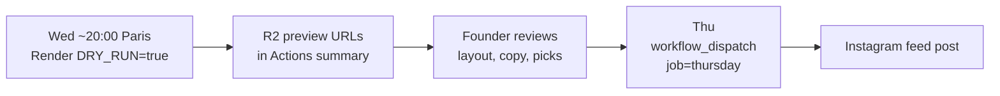

# Thursday Lens — Editorial Spec

Locked Aug 2026. Decisions: [DECISIONS.md](DECISIONS.md). Calendar context: [CONTEXT.md](CONTEXT.md).

## Cycle

8-week repeating sequence:

```
Week:  1         2       3         4       5        6         7        8
Slot:  dance     area    dance     stats   area     dance     area     stats
→ repeat
```

Cycle position determines slot **type**. The selector picks the best **variant** inside that type based on live data.

## Event window

- **Thu–Sun only** (Europe/Paris), not full ISO week.
- Fetch from Thursday 00:00 through Sunday 23:59 of the relevant week.
- On Wed preview: upcoming Thu–Sun. On Thu publish: current Thu–Sun.
- **Exclude** event IDs featured in this week's Tuesday carousel.
- **Exclude** cancelled events (`activeEventsOnly()`).

## Scarcity

- Show **3 event cards** on dance/area posts (not 4 like Tuesday).
- Closing slide: "+X autres sur l'app" where X = total matching events minus 3.
- No address, ticket links, or full descriptions on slides.

## Areas (not cities)

| Slug | Display name | Example cities |
|------|--------------|----------------|
| `bab` | BAB | Bayonne, Anglet, Biarritz |
| `landes` | Landes | Dax, Mont-de-Marsan, Saint-Paul-lès-Dax |
| `bearn` | Béarn | Pau, Tarbes, Lourdes |
| `euskadi` | Euskadi | Donostia, Hondarribia, Irun |

City → area mapping lives in `src/config/areas.ts`.

**Naming:** "Béarn" is acceptable in social copy (Tarbes is Bigorre but brevity wins). Use **Euskadi**, not generic "Spain". Cross-border copy may use *"l'autre côté de la frontière"*.

### Area selection

```
score(area) = eventCount(area, thuSun) × freshnessFactor(area)
```

- Threshold: **≥ 3 events** in area
- Cooldown: **2 weeks** per area
- Tie-break: highest count, then least recently featured

## Dance spotlight

### Core dances

`salsa`, `bachata`, `kizomba`

```
score(dance) = eligibleEventCount(dance) × freshnessFactor(dance)
```

- Threshold: **≥ 2 eligible events**
- Cooldown: **3 weeks** per core dance

### SBK tier multipliers (event card selection)

When picking the 3 featured events for a dance spotlight:

| Event composition | Multiplier |
|-------------------|------------|
| Pure featured dance only | 1.0 |
| Featured + bachata (no kizomba) | 0.75 |
| Featured + other non-core | 0.50 |
| Full SBK (salsa + bachata + kizomba) | 0.40 |

Show all dance pills on each card. Highlight featured dance in headline.

**Copy:**
- Mostly pure/partial: *"3 soirées salsa ce week-end"*
- Mostly SBK fill: *"3 soirées salsa et SBK ce week-end"*

### Autres danses bundle

Rare slugs: `zouk`, `semba`, `west-coast-swing`, `tango-argentin`

- Trigger: combined count **≥ 3** in Thu–Sun window
- Competes for dance slots via scoring + cooldown
- Headlines: *"Et si tu sortais des sentiers battus ?"* / *"LatinGo, c'est pas que SBK"*
- Prefer one event per rare dance type on cards
- Ledger key: `autres-danses`

## Slot variants

| Slot type | Default variant | Alternate variant | Trigger |
|-----------|-----------------|-------------------|---------|
| Dance | Dance spotlight | Autres danses | Rare combined ≥ 3 |
| Area | Area focus | Cross-border | Euskadi ≥ 4 AND French areas combined ≥ 4 |
| Stats | Weekly stats | Salsa vs Bachata duel | Salsa ≥ 5 AND Bachata ≥ 5 |

### Weekly stats (default)

Metrics for Thu–Sun window: total events, areas active, dance styles, new events this week. Lead with completeness, not install counts.

### Salsa vs Bachata duel

Side-by-side counts. One hero visual per dance. No individual event details.

### Cross-border

FR vs ES event counts. Headline: *"L'autre côté de la frontière"*. Ledger key: `cross-border`.

## Fallback cascade

| Condition | Action |
|-----------|--------|
| Dance slot, no core dance ≥ 2 | Try autres danses; else skip, log thin week |
| Area slot, no area ≥ 3 | Try cross-border if thresholds met; else skip |
| Stats slot, total events < 10 | Skip Thursday publish |
| Selected events < 1 after filters | Do not render; do not publish |

Never auto-publish a weak or empty template.

## Rotation ledger

File: `thursday-state.json` (repo root or committed state). Update **only after successful publish**.

Tracks: cycle position, last featured dances/areas, variant history, Tuesday carousel IDs, cooldown weeks.

## Founder review (required)

**Thursday feed posts are never auto-published.**



### Automated pre-render checks

- ≥ 1 event card rendered (when applicable)
- No Tuesday carousel ID overlap
- Closing "+X autres" count > 0 (when applicable)
- Ledger state printed for audit

### When template code changes

Re-validate locally before first live publish:

```bash
DRY_RUN=true npm run render:thursday-preview
```

## Diversity safeguards

| Risk | Safeguard |
|------|-----------|
| Salsa dominates | 3-week dance cooldown; SBK tiers deprioritize full SBK |
| BAB always wins | 2-week area cooldown; full area pool |
| Same events Tue + Thu | Hard exclude Tuesday carousel IDs |
| Rare dances invisible | Autres danses bundle at ≥ 3 combined |
| Weak post goes live | Fallback → skip; founder review gate |

## Deferred (not v1 automation)

- Soirée fidèle (recurring hero) — manual
- Nouveau dans ta ville (Template 6) — rare teaser
- Trending / month-over-month stats
- Danseur nomade multi-area circuit
